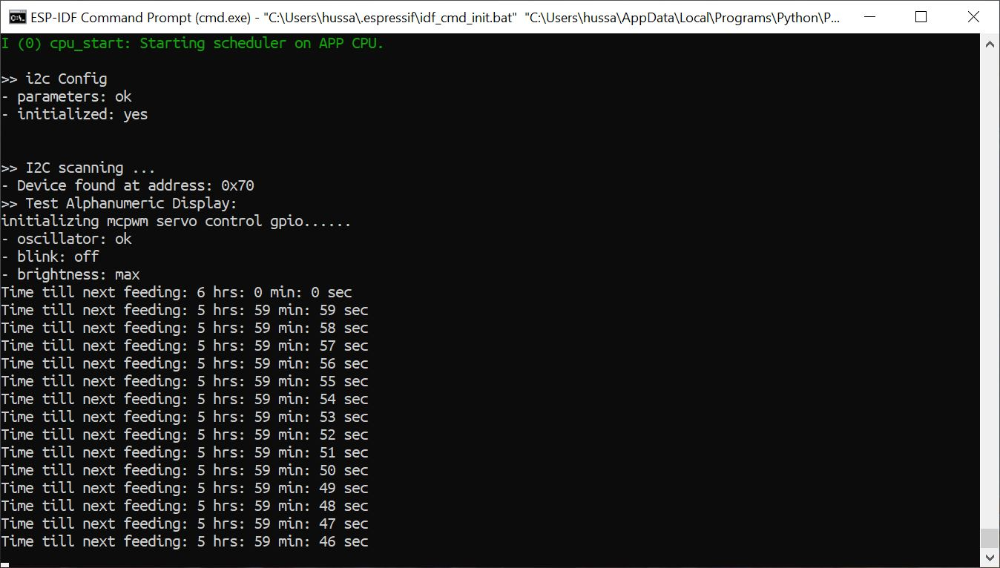
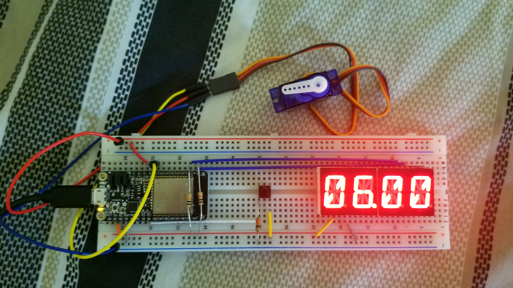
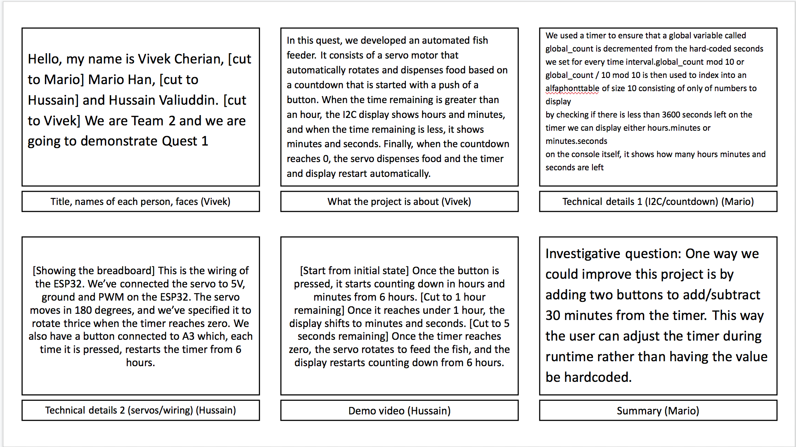

# Quest 01: Fish Feeder
Authors: Vivek Cherian, Mario Han, Hussain Valiuddin

Date: 2020-09-22
-----

## Summary

In the skills pertaining to this quest, we created timers, managed multiple tasks, and wired LEDs, buttons, and the I2C alphanumeric display. In the quest, we tied all of this together to create a fish feeder that automatically rotates and shakes to dispense food at automated time intervals (we chose once every 6 hours) 

Every 6 hours, the servo moves left and right three times. The I2C display shows Hours.Minutes and Minutes.Seconds when timer reaches less than 1 hour.

For the investigive question, we decided that it would be best if there was a second button in which it will set the time in half hour increments. Instead of hard coding, 6 hours, the user will press the "start" button once to set the timer and another button will be needed so that the user can set how many hours/minutes they would like.

## Self-Assessment

It was hard to implement different parts of each code into one giant code. However, because the previous skills were detailed enough that the final solution was the combination of all these things, it wasn't as difficult as we previously though.

### Objective Criteria

| Objective Criterion | Rating | Max Value  | 
|---------------------------------------------|:-----------:|:---------:|
| Servo spins right then left three times without chatter at prescribed time intervals | 1 |  1     | 
| ALphanumeric display indicates hours and minutes | 1 |  1     | 
| Display shows countdown time report every second with no time loss | 1 |  1     | 
| Food dispensed at specified times | 1 |  1     | 
| Demo delivered at scheduled time and report submitted in team folder with all required components | 1 |  1     | 
| Investigative question response | 1 |  1     | 
| ***Total objective criteria*** | ***6*** | ***6*** |


### Qualitative Criteria

| Qualitative Criterion | Rating | Max Value  | 
|---------------------------------------------|:-----------:|:---------:|
| Quality of solution | 5 |  5     | 
| Quality of report.md including use of graphics | 3  |  3     | 
| Quality of code reporting | 3  |  3     | 
| Quality of video presentation | 3 |  3     |
| ***Total qualitative criteria*** | ***14*** | ***14*** | 


## Solution Design

Our solution design for the code was based off of skill 11 and 10. We had 3 tasks that needed to start which was I2C display, counter (for time) and printing the timer in hours,minutes, and seconds. In doing so, we took parts of skill 11 and 10, replaced LED binary count from skill 7 that was in skill 10, and added ```global_counter```, a global variable that acts as a counter for seconds. The servo itself is made to rotate within a for loop that runs three times. In each iteration, the motor turns 180 degrees counterclockwise and then 180 degrees clockwise. We change direction by first incrementing the angle that is passed into ```mcpwm_set_duty_in_us()``` and then decrementing it. The starting and ending positions are set by ```MIN_PULSE_WIDTH``` and ```MAX_PULSE_WIDTH```. The for loop is set off when ```global_counter``` reaches 0.
We initialized ```global_counter``` to the equivalent of 6 hours to result in feeding 4 times a day. We also adjust the format of the time that is displayed; time is displayed in hours and minutes when time remaining is greater than or equal to an hour, and in minutes and seconds otherwise. Time remaining is also printed to the console as shown in Figure 1 below. We also implemented a push to start mechanism: when the board is flashed or reset, the countdown starts on the push of a button located between the ESP32 and the I2C display, as is seen in Figure 2.

## Sketches and Photos

Figure 1: Console displaying start of program and start of timer:


Figure 2: Wiring of ESP32, I2C display, button, and servo motor:


Figure 3: Storyboard for demo video:


## Supporting Artifacts

[Demo video](https://drive.google.com/file/d/1g3_zGDu6H-xdC5ByHxcXcN8vJxZVtbuS/view?usp=sharing)

[Team Github](https://github.com/BU-EC444/Team2-Cherian-Han-Valiuddin/tree/master/quest-1)

## Modules, Tools, Source Used Including Attribution
[I2C display example code](https://github.com/BU-EC444/code-examples/tree/master/i2c-display)

[Servo control example code](https://github.com/espressif/esp-idf/tree/master/examples/peripherals/mcpwm/mcpwm_servo_control)

## References

[ESP-IDF FreeRTOS guide](https://docs.espressif.com/projects/esp-idf/en/latest/esp32/api-reference/system/freertos.html)


-----

