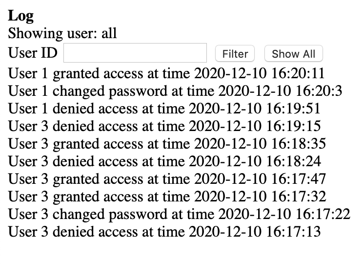
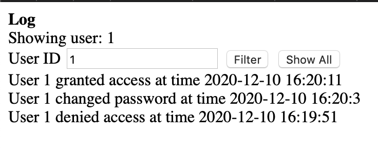
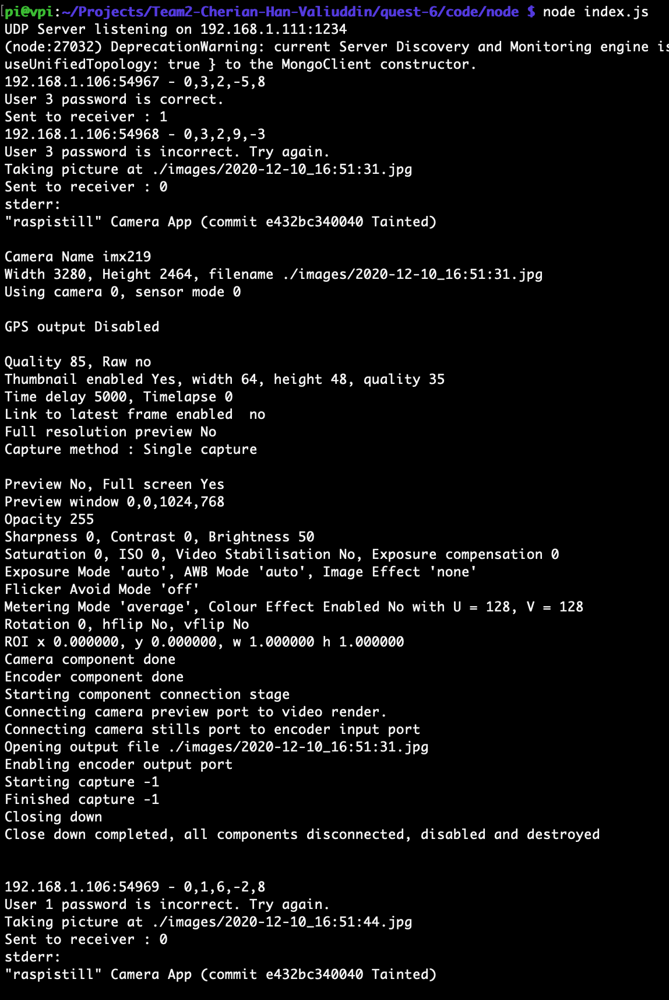
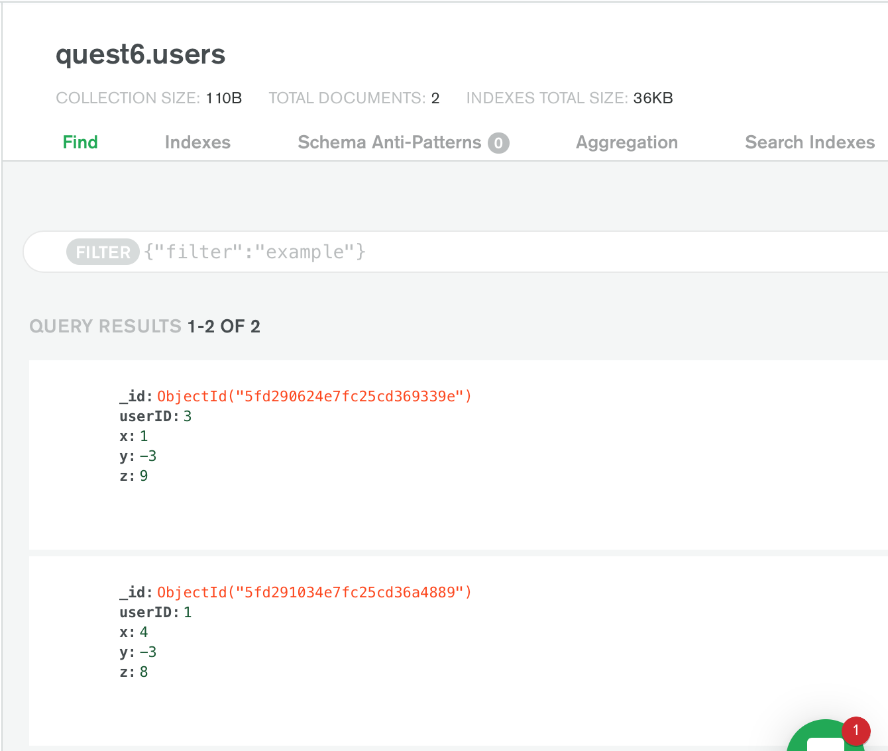
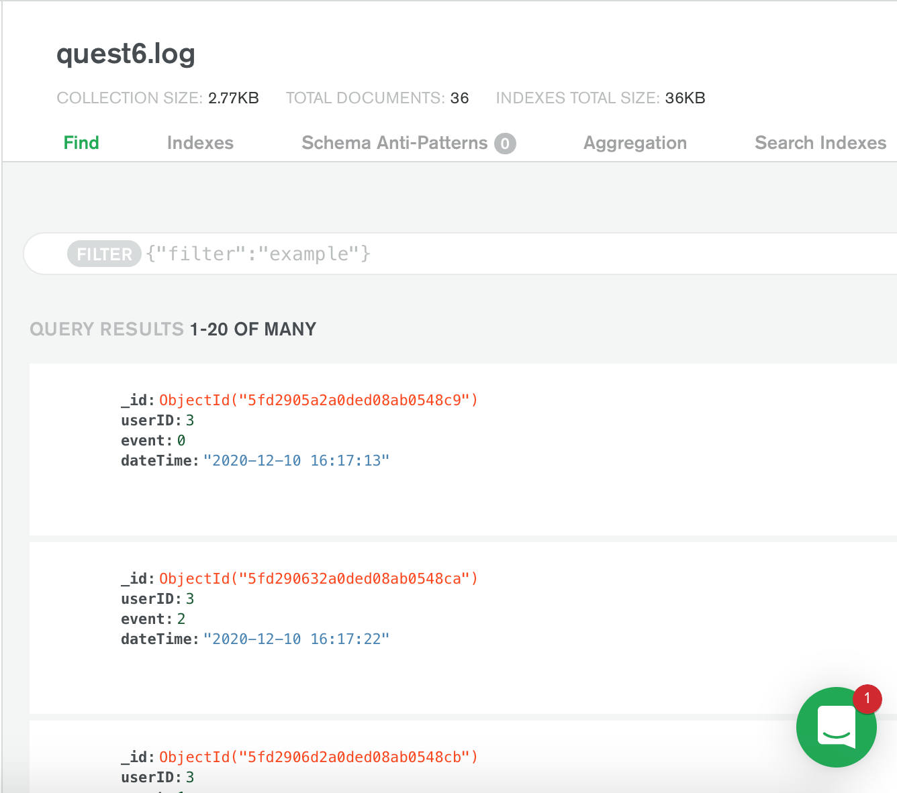

# Quest 6: Rollup (Smart Lock and Key)
Authors: Vivek Cherian, Hussain Valiuddin, Mario Han

Date: 2020-12-10
-----

## Summary

Our final quest is called Smart Lock. In short, for contactless and secure locking/unlocking, we made a lock that takes the orientation from the key (small board) as X, Y, and Z values for the password and checks if it is in our mongo database. 

The logs of whoever changes password, gets access (unlock), or gets denied (locked w/ wrong password) is shown in our node server, vivpi.ddns.net:4444. It shows up to 50 of the most recent logs with the most recent on top. If the person who uses the key inputs the wrong password, it takes a picture and stores it into the pi. That way, only the owners will be able to check who tried to open the lock. If unlocked, the servo turns to unlock and stays for 5 seconds then goes back.
To set the password, the user presses the button on the lock and waits to see a blue LED to show up. The user has atleast 3 seconds to set the password before it goes back out of the set password state.
If the user inputs guesses a password before they set password for themselves, it is treated as a fail password and a picture is taken.

On the key itself, there is a button to input the password (orientation) of the key based on the accelerometer values. There is a total of 343 password combinations since X,Y, and Z values can be (9,6,3,0,-3,-6,-9). We chose to settle on these values so that there is wiggle room in getting the values of the accelerometers for the user.
We can change the allowance if we need to be more secure.

If we had more materials we would ideally hide the board and the raspberry pi so that only the alphanumeric display, pi camera, and IR reciever is visible. Also, we would need to use a better IR transmitter and reciever.

We used 2 Actuators: a servo and a alphanumeric display
We used 3 Sensors: button , IR receiver, accelerometer
We also made 3 keys and 1 lock.
We used raspberry pi camera module to take picture when bad password.

Summarizing changes since live demo:
1. Replaced live stream with taking pictures on each 'denied access event'
2. added User IDs 1, 2, and 3
3. log shows most recent events on top
4. Alphanumeric display on each key displays 'OPEN', 'NOPE', and 'SET' for correct password, failed password, and set password, respectively.
5. xyz orientations are now rounded to the nearest int, and the server takes checks the password with a plus minus allowance 
6. website shows the id that is currently being filtered for. 'Clear' button changed to 'Show All'

## Self-Assessment

### Objective Criteria

| Objective Criterion | Rating | Max Value  | 
|---------------------------------------------|:-----------:|:---------:|
| Objective One |  |  1     | 
| Objective Two |  |  1     | 
| Objective Three |  |  1     | 
| Objective Four |  |  1     | 
| Objective Five |  |  1     | 
| Objective Six |  |  1     | 
| Objective Seven |  |  1     | 

### Qualitative Criteria

| Qualitative Criterion | Rating | Max Value  | 
|---------------------------------------------|:-----------:|:---------:|
| Quality of solution |  |  5     | 
| Quality of report.md including use of graphics |  |  3     | 
| Quality of code reporting |  |  3     | 
| Quality of video presentation |  |  3     | 

## Solution Design

The Lock: There is an IR reciever and recieve task which gets data from IR. When it recieves data, it lights the green LED and sends the data over UDP packet to the node server on raspberry pi. It also has a button on it which can be used to indicate if we are checking or setting the password. If the button was pressed before we recieved the data, this password is stored in mongoDB for future use. Based on the response, it can either open the look if the password is correct and display "OPEN" on alphanumeric. If it is wrong password, then it says "NOPE". If setting the password and successful, it says "SET". If unlocked the servo is turned and goes back to lock.

The Key: There is an IR transmitter, accelorometer, and a button with an H-Bridge to increase current through the IR LED. When the button is pressed, it sends the current X,Y,Z acceleration values along with the key ID. The Key ESP doesn't wait for a response back. An LED lights up when it is sent.

So we used vivipi.ddns.net:4444 to show logs of who unlocked, locked, or set password. Index.html retrieves the latest 50 events from the mongoDB collection. It dispays it on the page with the most recent on top and has a filter for User IDs. It shows which user it is currently filtering for too. 

The server receives UDP packets which is in the format {setBit, ID, X, Y, Z} and we add the current time and date to this object. When setBit is 1, we replace the User's password (depending on the ID of UDP) or set their password if they don't have one. When setBit is 0, we check the input password with the stored password for the user. 

We send back to the lock , 0 for failed password ,1 for correct password, and 2 for changed password which is displayed on the terminal as well as the website.
Note: the picture taken from a bad password is stored in raspberry pi and the name of the file would be when the same time stamp that appears in the fail log.

We chose not to give indication of picture taken on the website because the owner of the log can look at the timestamp on any "denied access" event and look for that same time stamp in the images folder. This is more secure for whoever owns this because the path to the image isn't displayed for outsiders. The console output of the server, however, will show the filename of the image when one is taken.

## Sketches and Photos
Log from website:

Log from website filtered for User 1:

Console of node server:

Users collection on Mongo DB:

Log collection on Mongo DB:

## Supporting Artifacts
- [Link to video demo](https://drive.google.com/file/d/1vP-z7Dfg-Y_co0Ezb22PUyRCTN5icdHv/view?usp=sharing).

## Modules, Tools, Source Used Including Attribution
[IR code](https://github.com/BU-EC444/code-examples/tree/master/traffic-light-ir-example)
[MCPWM code](https://github.com/espressif/esp-idf/tree/master/examples/peripherals/mcpwm/mcpwm_servo_control)
[I2C display](https://github.com/BU-EC444/code-examples/tree/master/i2c-display)
[Accelerometer code](https://github.com/BU-EC444/code-examples/tree/master/i2c-accel)
[UDP client code](https://github.com/espressif/esp-idf/tree/master/examples/protocols/sockets/udp_client)

## References
- [Camera operation](https://www.raspberrypi.org/documentation/raspbian/applications/camera.md)
- [Camera setup instructions](https://www.raspberrypi.org/documentation/configuration/camera.md)

-----

